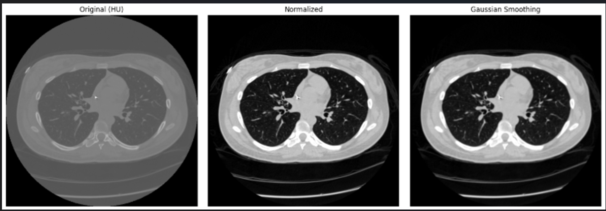

# Pulmonary Nodule Detection in 3D CT Scans Using YOLOv7

## Project Overview

This project focuses on preprocessing 3D lung CT scan data from the LUNA16 dataset and preparing it for pulmonary nodule detection using YOLOv7. The implemented pipeline includes CT scan preprocessing, 2D slice generation, YOLO-format annotation generation, dataset organization, and preparation of the dataset for YOLOv7-based object detection.
The project includes CT scan preprocessing, 2D slice generation, bounding box annotation, conversion to YOLO format, and preparation of the dataset for YOLOv7-based object detection.
---

## Dataset

This project uses the **LUNA16 dataset**, which contains lung CT scans and annotations for pulmonary nodules.

### Dataset Components

- 3D lung CT scans stored in `.mhd` and `.raw` formats
- Annotation files containing the locations and diameters of pulmonary nodules
- Ground-truth information used to generate bounding boxes for object detection

Since YOLOv7 is designed for 2D object detection, the 3D CT volumes are processed into 2D cross-sectional image slices before generating the corresponding annotations.
---

## 3. Project Workflow

### 1. CT Scan Preprocessing

The 3D CT scan volumes are loaded using **SimpleITK** and processed for further analysis.

The preprocessing workflow includes:

- Reading 3D CT scan volumes from `.mhd` files.
- Extracting the CT scan volume and its spatial information.
- Converting the 3D volume into 2D cross-sectional slices.
- Processing the slices to make them suitable for object detection.
- Saving the generated 2D slices in an organized directory structure.

### 2. Annotation Generation

The nodule annotations from the LUNA16 dataset are used to generate bounding boxes for pulmonary nodules.

The annotation workflow includes:

- Extracting pulmonary nodule coordinates and diameters from the dataset annotations.
- Mapping the 3D nodule coordinates to the corresponding 2D CT scan slices.
- Generating bounding boxes around each pulmonary nodule.
- Converting the annotations into the YOLO format:

`class_id x_center y_center width height`

- Normalizing the bounding box coordinates based on the image dimensions.
- Saving the annotations as `.txt` files corresponding to each CT scan slice.
- Visualizing the generated bounding boxes on CT scan images to verify annotation accuracy.

### 3. Dataset Organization

After preprocessing and annotation generation, the dataset is organized according to the YOLOv7 directory structure.

The dataset includes:

- Training and validation image folders.
- Corresponding YOLO annotation files for each image.
- A `data.yaml` configuration file specifying the dataset paths, number of classes, and class names.

The directory structure is organized as follows:

```dataset/
├── images/
│   ├── train/
│   └── val/
│
└── labels/
    ├── train/
    └── val/
```
## YOLOv7 Model Preparation
The dataset and training pipeline are prepared for YOLOv7-based pulmonary nodule detection. Model training and evaluation are planned as the next phase of the project.

The model preparation includes:

- Using pretrained YOLOv7 weights for transfer learning.
- Configuring the dataset through the `data.yaml` file.
- Setting training parameters such as image size, batch size, and number of epochs.
- Preparing the training pipeline for pulmonary nodule detection.

This setup enables efficient training of the model on the processed CT scan slices.
## Future Work

The next phase of the project involves training the YOLOv7 model using the prepared dataset and evaluating its performance.

Future improvements include:

- Training the model using pretrained YOLOv7 weights.
- Evaluating performance using Precision, Recall, and mAP.
- Optimizing hyperparameters for improved detection accuracy.
- Applying data augmentation techniques to improve model robustness.

## Technologies Used

- Python
- NumPy
- Pandas
- TensorFlow
- OpenCV
- SimpleITK
- pydicom
- Matplotlib
- YOLOv7

  ## Results

### Image Preprocessing

The figure below shows the preprocessing pipeline applied to the CT scan slices, including the original image, normalization, and Gaussian smoothing.



### Bounding Box Annotation

The generated bounding boxes represent pulmonary nodule locations converted into YOLO annotation format for object detection.


